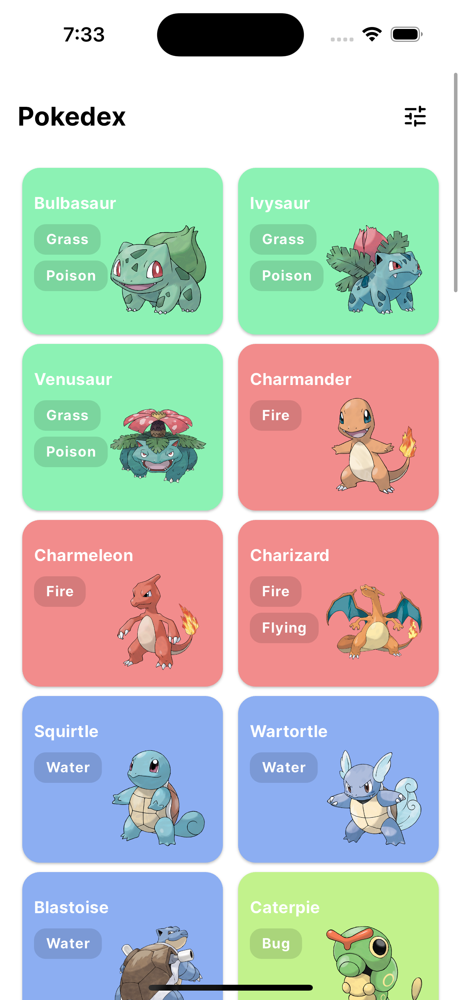
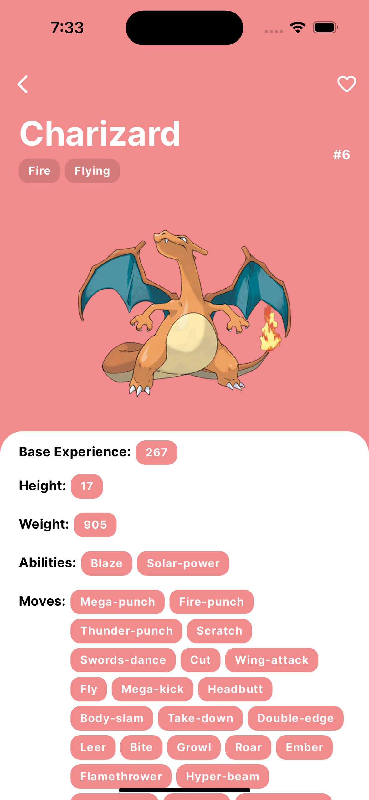

# Pokemon JohCode - Pokedex

This project uses the Pokémon GraphQL API to display information about Pokémon. It uses technologies like Riverpod for state management, GoRouter for navigation, and follows a hexagonal architecture for a modular and easy-to-maintain structure.

## Used API

The application uses the Pokémon GraphQL API to fetch data about Pokémon. You can find more information about this API at [https://graphql-pokeapi.vercel.app/](https://graphql-pokeapi.vercel.app/).

## Technologies Used

- **Riverpod**: It is used to manage the application state efficiently and scalably.
- **GoRouter**: Provides a simple and flexible routing system for navigation between the different screens of the application.
- **GraphQL**: It is employed to efficiently query the Pokémon API and fetch the necessary information to display in the application.
- **Hexagonal Architecture**: The application follows a hexagonal architecture to maintain a modular and decoupled structure, facilitating development and code evolution.

## Application Sections

### Home Page

On the home page, users can explore a basic list of Pokémon. Each Pokémon card displays basic information such as name, image, and type of the Pokémon. Users can also search and filter Pokémon by type.

### Detail Page

On the detail page, users can view more detailed information about a specific Pokémon. This includes details such as statistics, abilities, and evolution of the Pokémon. Users can also view additional images of the Pokémon.

## Getting Started

To get started with the project, follow these steps:

1. Clone the repository to your local machine.
2. Navigate to the project directory in your terminal.
3. Run `flutter pub get` to install dependencies.
4. If necessary, run the build runner command to generate files (`flutter pub run build_runner build`).

That's it! You're now ready to run the application and explore the world of Pokémon.

